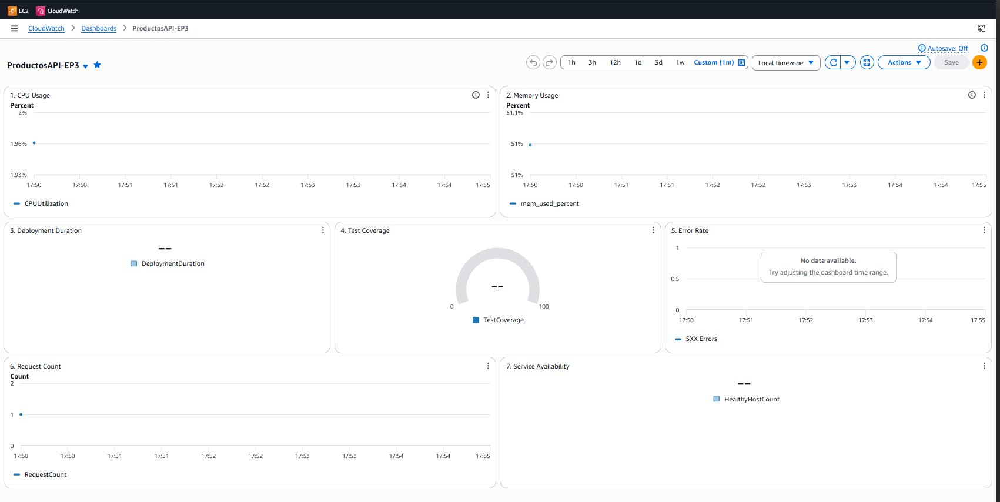
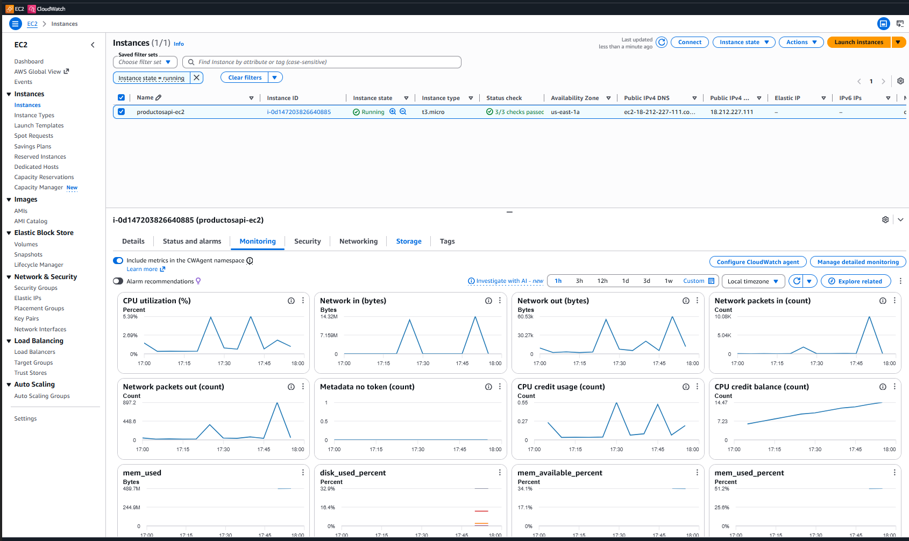
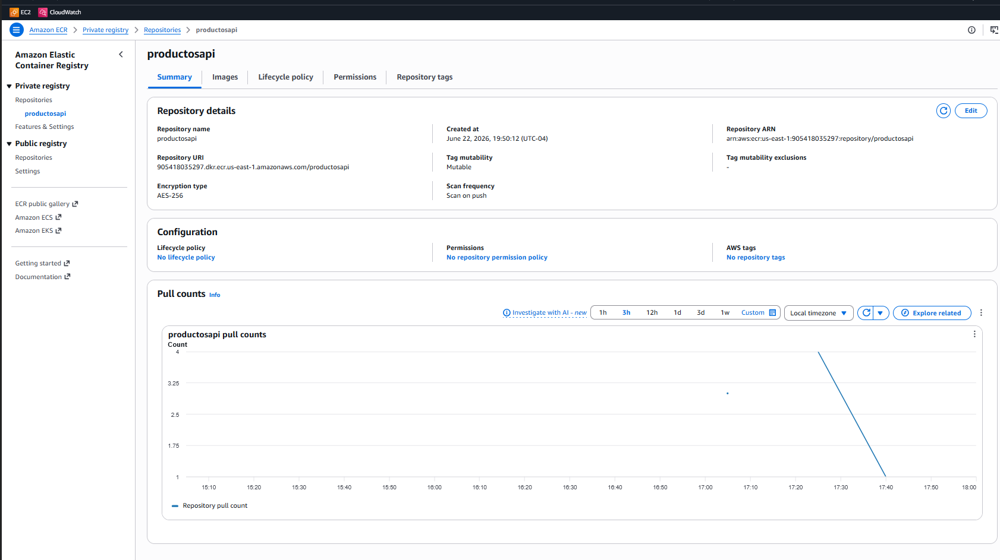
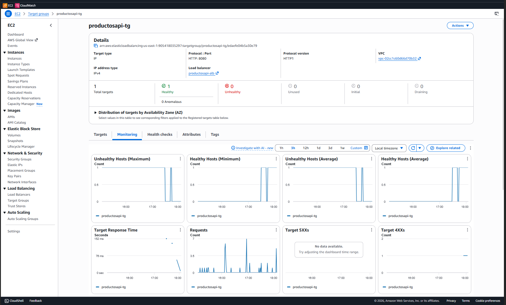
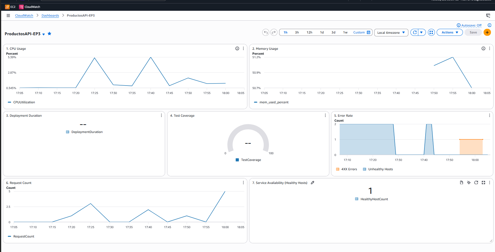
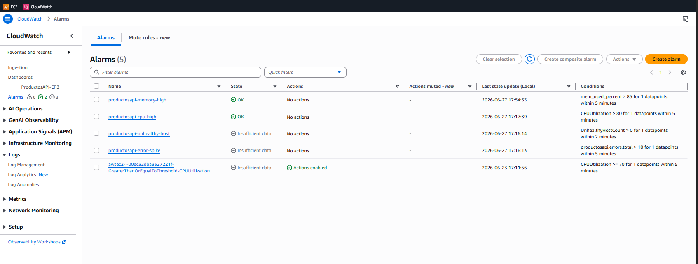
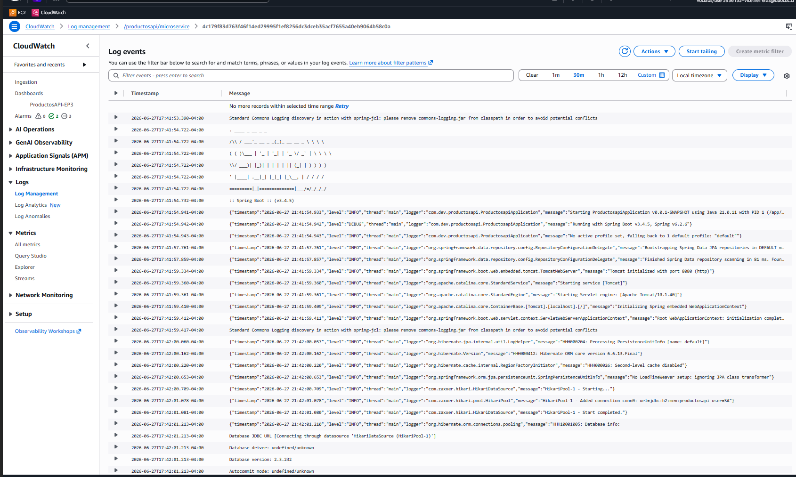
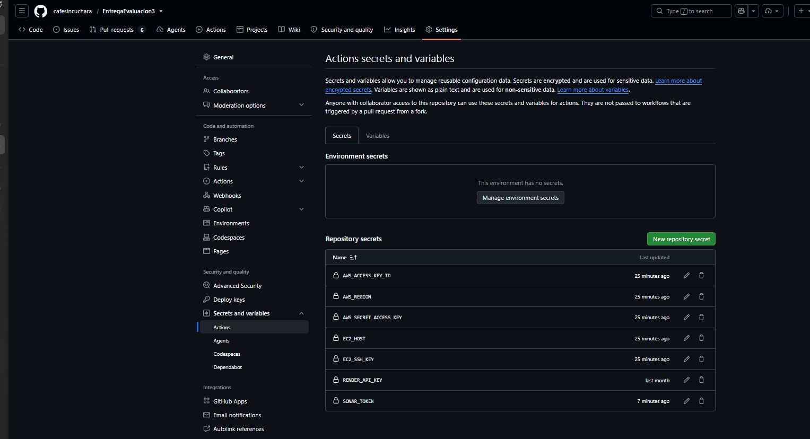
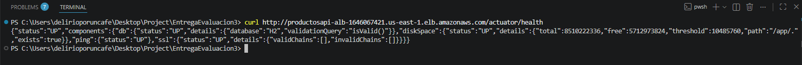

# Evaluacion Parcial 3 - Observabilidad y entornos reales en DevOps

**Integrantes:** Brayan Gonzalez, Vicente Herrera  
**Repositorio:** [EntregaEvaluacion3](https://github.com/cafesincuchara/EntregaEvaluacion3)
**API en produccion:** [http://productosapi-alb-1646067421.us-east-1.elb.amazonaws.com/api/v1/products](http://productosapi-alb-1646067421.us-east-1.elb.amazonaws.com/api/v1/products)
**API Brayan:** [http://107.23.115.153:8080/api/v1/products](http://107.23.115.153:8080/api/v1/products)
**SonarCloud:** [https://sonarcloud.io/dashboard?id=productosapi](https://sonarcloud.io/dashboard?id=productosapi)

---

## Resumen del proyecto

Microservicio REST en Spring Boot 3.4 con operaciones CRUD de productos y base de datos H2 en memoria, desplegado en AWS EC2 con Docker detras de un Application Load Balancer. El pipeline CI/CD automatiza compilacion, pruebas, analisis de calidad, construccion de imagen Docker, push a ECR y despliegue en EC2 via SSH.

---

## Pipeline CI/CD (GitHub Actions)

El pipeline se ejecuta en cada push a `main` o `develop` y esta compuesto por 3 jobs secuenciales:

```
[push] -> [validate] -> [build] -> [deploy]
```

Cada job depende del anterior mediante `needs`. Si algo falla, no se sigue adelante.

### validate
- Tests unitarios (JUnit 5 + Mockito)
- JaCoCo: cobertura minima 80%
- Trivy: escaneo de seguridad (CRITICAL/HIGH detienen el pipeline)
- SonarCloud: analisis de calidad + Quality Gate
- Check CloudWatch Alarms (si hay alarmas activas, no despliega)
- Script de auditoria automatizada
- Busqueda de secretos hardcodeados

### build
- Compilar con Maven
- Construir imagen Docker
- Subir a Amazon ECR con tag `${{ github.sha }}` + `latest`

### deploy
- SSH a EC2
- Pull de la ultima imagen desde ECR
- Stop/start del contenedor con `--log-driver awslogs`
- Publicar metricas (DeploymentDuration, TestCoverage)
- Verificar health endpoint

---

## Infraestructura AWS

| Componente | Descripcion |
|---|---|
| **EC2** | Instancia `t3.micro` con Amazon Linux 2023, Docker, CloudWatch Agent |
| **ALB** | Application Load Balancer internet-facing, listener HTTP:80 -> TG |
| **Target Group** | HTTP:8080, health check `/actuator/health` |
| **ECR** | Repositorio `productosapi` con `scanOnPush=true` |
| **CloudWatch** | Logs, metricas personalizadas, 4 alarmas, dashboard con 7 widgets |

---

## Capturas de pantalla

### Auto-refresh dashboard


### EC2 instancia


### ECR imagenes


### ALB + Target Group healthy


### Dashboard completo


### Alarmas CloudWatch


### Logs en CloudWatch


### GitHub Secrets


### curl ALB response


---

## Uso de la API

**Base URL:** `http://productosapi-alb-1646067421.us-east-1.elb.amazonaws.com/api/v1/products`

### GET — Listar todos los productos

```powershell
Invoke-RestMethod -Uri "http://productosapi-alb-1646067421.us-east-1.elb.amazonaws.com/api/v1/products"
```

### GET — Obtener producto por ID

```powershell
Invoke-RestMethod -Uri "http://productosapi-alb-1646067421.us-east-1.elb.amazonaws.com/api/v1/products/00000000-0000-0000-0000-000000000001"
```

### POST — Crear un producto

```powershell
Invoke-RestMethod -Method Post `
  -Uri "http://productosapi-alb-1646067421.us-east-1.elb.amazonaws.com/api/v1/products" `
  -ContentType "application/json" `
  -Body '{"id":"550e8400-e29b-41d4-a716-446655440000","name":"Laptop Gamer","price":1500.00}'
```

### PUT — Actualizar un producto

```powershell
Invoke-RestMethod -Method Put `
  -Uri "http://productosapi-alb-1646067421.us-east-1.elb.amazonaws.com/api/v1/products/550e8400-e29b-41d4-a716-446655440000" `
  -ContentType "application/json" `
  -Body '{"name":"Laptop Gamer Pro","price":1800.00}'
```

### DELETE — Eliminar un producto

```powershell
Invoke-RestMethod -Method Delete `
  -Uri "http://productosapi-alb-1646067421.us-east-1.elb.amazonaws.com/api/v1/products/550e8400-e29b-41d4-a716-446655440000"
```

### Formato del JSON (POST / PUT)

```json
{
  "id":   "uuid",
  "name": "Nombre del producto",
  "price": 99.99
}
```

> ⚠️ El `id` debe ser un UUID válido. El precio no puede ser negativo.
> En POST el `id` es obligatorio. En PUT solo se envía `name` y `price`.

---

## Declaracion de uso de IA

Durante el trabajo usamos herramientas de IA como apoyo tecnico para:
- Generar y depurar scripts de automatizacion (AWS CLI, CloudWatch, SSM)
- Configurar metricas y alarmas de CloudWatch
- Estructurar workflows de GitHub Actions
- Optimizar consultas y comandos de AWS

---

## Reflexiones Individuales

**Brayan Gonzalez**

yo he comprendido q el funcionamiento de la orquestacion basicamente
seria el manual de instrucciones para el servidor al cual subimos nuestro proyecto,
en el fondo seria como queremos q el lo ejecute y el despliegue vendria siendo la orden final
que le damos una vez superadas todas las pruebas del pipeline y que bueno todo esto tendria como
finalidad tener una mayor eficiencia ya que mientras los programadores escriben codigo todo los demas procesos
que tengan que ver con pruebas esto lo haria la maquina automaticamente, no habria errores gracias a las
reglas que definimos, y la escabilidad, que en pocas palabras gracias al compose el servidor ya sabria
como manejar esos recursos sin asfixiarse por la reparticion del trafico en el compose

**Vicente Herrera**

Utilice la IA en gran medida para perfeccionar y automatizar los procesos de creacion de alarmas, grupos, subnets etc,
Siempre estoy teniendo en criterio de error sobre lo que se esta realizando en el proyecto.


Trigger: deploy with updated AWS credentials v2
